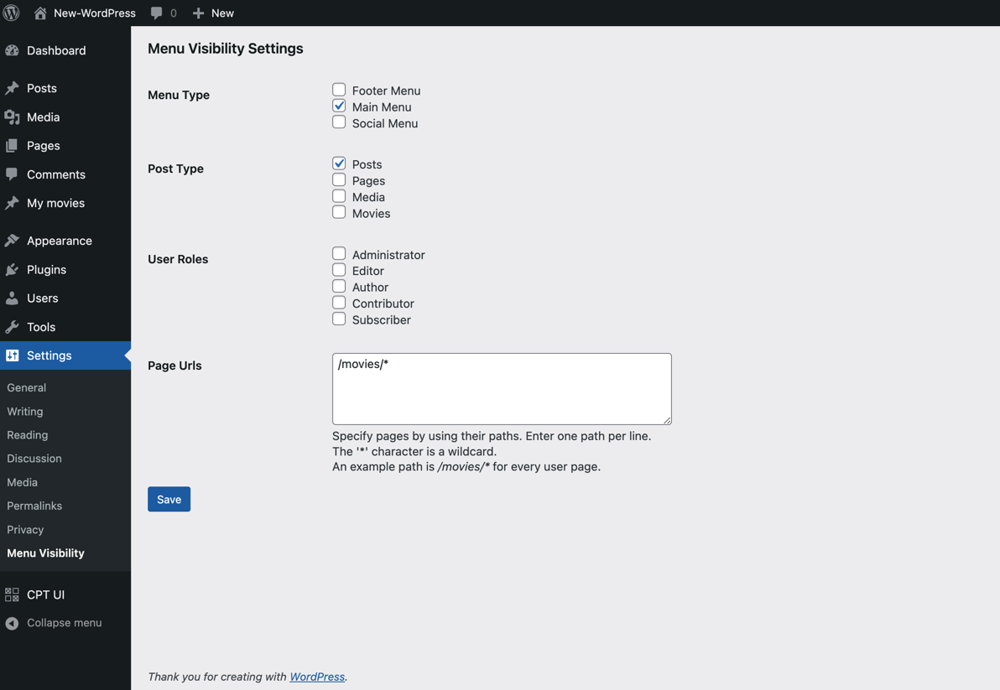

# Menu Visibility

**Menu Visibility** is a WordPress plugin which adds extra functionality for menus, making it easy to hide or display menus based on configurations. Example:

- Hide/Display a menu from Post type(s).
- Hide/Display a menu for specific page url(s).
- Hide/Display a menu for specific user role(s).

> This repo is used only for development, downloading & installing from here won't work as expected. Install from [Menu Visibility](https://github.com/sonvir249/menu-visibility)

## Screenshot:

